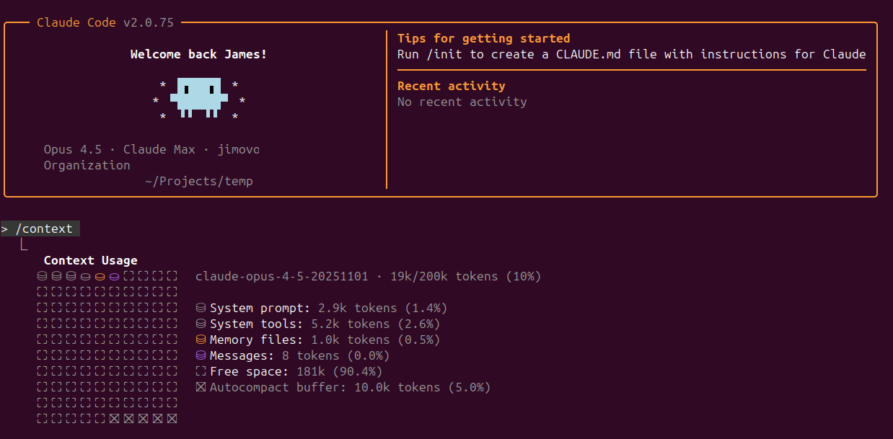

# Claude Context Manager

[](https://github.com/jimovonz/claude-context-manager)
[](LICENSE)
[](https://www.python.org/)
[](https://www.linux.org/)
[](https://claude.ai/claude-code)

Hooks and tools for managing Claude Code's context window to prevent premature compaction.

**Platform Support:** Linux only. No Windows testing has been done.



## The Problem

Claude Code's context window is finite. When filled, automatic compaction discards content - often removing critical reasoning chains and decisions mid-task. Large tool outputs (grep results, build logs, file listings) are the primary cause.

## The Solution

This system intercepts tool calls to manage context proactively:

1. **Execute in hooks** - Commands run inside hooks, results cached if large
2. **Return references** - Main agent gets pointers to cached data, not the data itself
3. **Delegate to subagents** - Task agents access full content without polluting main context
4. **External compaction** - Route summarization to cheaper external LLMs via OpenRouter
5. **Purge on demand** - `/purge` command truncates old outputs

## Requirements

- **Linux** (no Windows support)
- Python 3.10+
- Claude Code CLI v2.0.75+ installed
- `aiohttp` for the thinking proxy: `pip install aiohttp`
- (Optional) OpenRouter API key for external compaction
- (Optional) `tiktoken` for accurate token counting: `pip install tiktoken`

## Quick Start

```bash
# Clone and install
git clone https://github.com/jimovonz/claude-context-manager.git
cd claude-context-manager
python3 install.py

# Install dependencies
pip install aiohttp tiktoken

# Launch Claude with CCM
c
```

The installer creates a symlink at `~/.local/bin/c`. If not in PATH, add to `~/.bashrc` or `~/.zshrc`:
```bash
export PATH="$HOME/.local/bin:$PATH"
```

## The `c` Command

The `c` command launches Claude Code with CCM integration:

```bash
c                           # Launch with proxy and permissions skip
c --resume abc123           # Resume a session
c -p "do something"         # Run with prompt
```

What `c` does:
1. Starts the thinking proxy (if not running)
2. Runs `claude` with env vars scoped to that process only:
   - `ANTHROPIC_BASE_URL` - Routes through proxy
   - `ANTHROPIC_CUSTOM_HEADERS` - Session ID for tracking
   - `CLAUDE_AUTOCOMPACT_PCT_OVERRIDE` - Compaction threshold
3. Adds `--dangerously-skip-permissions`

No terminal pollution - env vars are only set for the claude process.

### Configuration

Override defaults with env vars:

```bash
COMPACT_PCT=90 c                    # Different threshold
SKIP_PERMISSIONS=false c            # Prompt for permissions
THINKING_PROXY_PORT=9000 c          # Different port
```

## External Compaction (Optional)

Route Claude's automatic compaction to external LLMs (Gemini, GPT-4, etc.) via OpenRouter. Benefits:

- **Cheaper** - Use smaller, cheaper models for summarization
- **Better summaries** - Custom distillation prompts with artefact extraction
- **More context** - Recover the 22.5k token buffer Claude reserves

### Setup

1. Get an OpenRouter API key from [openrouter.ai](https://openrouter.ai)

2. Create credentials file:
```bash
cat > ~/.claude/credentials.json << 'EOF'
{
  "openrouter": {
    "api_key": "sk-or-v1-your-key-here"
  }
}
EOF
chmod 600 ~/.claude/credentials.json
```

Or set environment variable:
```bash
export OPENROUTER_API_KEY="sk-or-v1-your-key-here"
```

3. Enable in config (enabled by default if key is present):
```python
# ~/.claude/hooks/config.py
EXTERNAL_COMPACTION_ENABLED = True
```

### How It Works

When Claude triggers compaction, the proxy:

1. **Detects** compaction request via system prompt pattern
2. **Transforms** Claude messages to OpenAI format
3. **Routes** to OpenRouter (Gemini Flash by default)
4. **Extracts artefacts** (commands, paths, errors) for preservation
5. **Generates distillation** with full context of artefacts
6. **Appends artefacts** to guarantee preservation
7. **Returns** summary in Claude SSE format

### Model Selection

Configure in `~/.claude/hooks/config.py`:

```python
COMPACTION_MODELS = {
    'early': 'google/gemini-3-flash-preview',   # Compactions 1-5
    'late': 'google/gemini-3-flash-preview',    # Compactions 6+
}

COMPACTION_MAX_TOKENS = {
    1: 20000,
    2: 36000,
    3: 52000,
    4: 64000,
    5: 64000,
    'default': 64000
}
```

## Thinking Proxy

The thinking proxy manages Claude's thinking blocks and routes compaction requests.

### Features

- **Session tracking** - Tracks sessions for thinking block management
- **Compaction routing** - Routes `/compact` to external LLMs
- **No-thinking mode** - Strips thinking after purge to prevent API errors

### Starting the Proxy

```bash
# Linux (systemd) - auto-installed
systemctl --user start ccm-thinking-proxy
systemctl --user enable ccm-thinking-proxy  # Start on login

# Manual (any platform)
~/.claude/hooks/thinking-proxy.py start   # Start daemon
~/.claude/hooks/thinking-proxy.py status  # Check status
~/.claude/hooks/thinking-proxy.py stop    # Stop daemon
~/.claude/hooks/thinking-proxy.py restart # Restart daemon
```

### Debugging

Enable debug logging:
```python
# ~/.claude/hooks/config.py
THINKING_PROXY_DEBUG_LOG = True
```

Check logs:
```bash
tail -f ~/.claude/proxy.log
```

Compaction debug files:
- `~/.claude/last-compaction-request.json` - Full request to OpenRouter
- `~/.claude/last-artefacts.txt` - Extracted artefacts
- `~/.claude/last-distillation.txt` - Final distillation output

## Installation Details

### What Gets Installed

```
~/.claude/
├── hooks/
│   ├── intercept-bash.py      # Bash command interception
│   ├── intercept-glob.py      # File glob interception
│   ├── intercept-grep.py      # Grep/ripgrep interception
│   ├── intercept-read.py      # Large file read interception
│   ├── context-monitor.py     # Context usage warnings
│   ├── learn-large-commands.py # Pattern learning
│   ├── pre-compact.py         # Custom compaction instructions
│   ├── thinking-proxy.py      # Thinking block proxy
│   ├── claude-session-purge.py # Session purge tool
│   ├── config.py              # Configuration
│   └── lib/                   # Shared libraries
├── commands/
│   ├── purge.md               # /purge slash command
│   └── ccm.md                 # /ccm slash command
├── setup.sh                   # Shell function setup
├── compact-instructions.txt   # Compaction instructions (customizable)
├── credentials.json           # API keys (you create this)
├── proxy-state/               # Proxy session state
└── settings.json              # Hook registration (merged)
```

## Uninstallation

```bash
python3 uninstall.py
```

## Quick Disable/Enable

If hooks cause issues, quickly disable without uninstalling:

```bash
python3 disable.py   # Disable all hooks (keeps files)
python3 enable.py    # Re-enable hooks
```

Or use environment variable for a single session:
```bash
CLAUDE_HOOKS_PASSTHROUGH=1 claude
```

## Usage

### Important: "Blocking" Is Not an Error

When hooks intercept a tool call, Claude Code displays it as an "error" or "blocking" message in the terminal. **This is normal behavior, not an actual error.** The hook has:

1. Executed the command successfully
2. Returned the results (inline or cached)
3. Prevented double-execution by "blocking" the original call

Treat these messages as successful results unless they explicitly indicate a failure.

### Automatic Interception

Once installed, hooks work automatically:

- **Small outputs** pass through normally
- **Large outputs** (>2KB) are cached to `~/.claude/cache/`
- **Subagent calls** bypass interception (full access for Task agents)

When you see a cache reference:
```
Cached (1523 lines, 45678 bytes, exit 0).
File: ~/.claude/cache/a1b2c3d4
```

Options:
1. Spawn a Task agent to summarize or extract from the cached file
2. Use offset/limit parameters to paginate the original
3. Have a Task agent return full content if truly needed

### Context Warnings

At 70%, 80%, 90% context usage (configurable), you'll see warnings:
```
WARNING: Context at 72% (~144,000 tokens, tiktoken). Consider running /purge soon.
```

### The `/purge` Command

When context is critical, run `/purge` to:
- Truncate large tool outputs to CCM stubs
- Preserve recent context
- Restart session with preserved state

### Auto-Compaction Control

Compaction triggers at 95% context by default (configurable via `COMPACT_PCT` or `CLAUDE_AUTOCOMPACT_PCT_OVERRIDE`).

### Custom Compaction Instructions

When compaction occurs, `pre-compact.py` provides instructions for what to preserve. Customize by editing:
```bash
~/.claude/compact-instructions.txt
```

## Configuration

Edit `~/.claude/hooks/config.py`:

```python
# Cache settings
CACHE_DIR = Path.home() / '.claude' / 'cache'
CACHE_MAX_AGE_MINUTES = 60

# Output thresholds (bytes)
BASH_THRESHOLD = 2000
GLOB_THRESHOLD = 2000
GREP_THRESHOLD = 2000
READ_THRESHOLD = 25000

# Auto-compaction
AUTOCOMPACT_ENABLED = True
AUTOCOMPACT_THRESHOLD = 80   # percent of context

# Pre-compact hook
PRE_COMPACT_ENABLED = True

# Context monitor
CONTEXT_MONITOR_ENABLED = True
CONTEXT_WARN_THRESHOLDS = [70, 80, 90]

# External compaction
EXTERNAL_COMPACTION_ENABLED = True
# API key loaded from ~/.claude/credentials.json or OPENROUTER_API_KEY env var

# Thinking proxy
THINKING_PROXY_ENABLED = True
THINKING_PROXY_PORT = 8080
```

## Files That Bypass Interception

These always pass through unmodified:
- `CLAUDE.md`, `README.md` - Project documentation
- `*.json`, `*.yaml`, `*.yml`, `*.toml` - Configuration
- `*.lock`, `*.env*` - Lock and environment files

## Troubleshooting

### Bypass hooks temporarily
```bash
CLAUDE_HOOKS_PASSTHROUGH=1 claude
```

### Bypass proxy temporarily
```bash
unset ANTHROPIC_BASE_URL
claude
```

### Analyze session without changes
```bash
~/.claude/hooks/claude-session-purge.py --current --analyze
```

### Clear cache
```bash
rm -rf ~/.claude/cache/*
```

### Check proxy status
```bash
~/.claude/hooks/thinking-proxy.py status
```

### View proxy logs
```bash
tail -f ~/.claude/proxy.log
```

## Documentation

- Full documentation: `~/.claude/hooks/CONTEXT_MANAGEMENT.md`
- External compaction: `docs/EXTERNAL_COMPACTION.md`

## License

MIT
