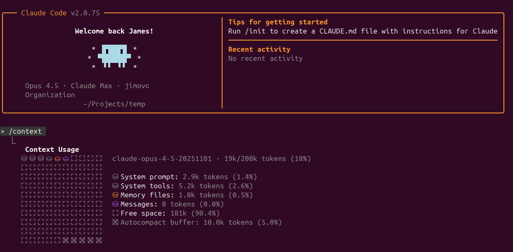

# Claude Context Manager

> **This project is no longer maintained.**
>
> CCM was built when Claude Code had a 200k token context window and compaction was a constant pain point. With the introduction of 1M token contexts, the core problem CCM solved is far less pressing. Additionally, CCM relies on patching the Claude Code CLI binary (`cli.js`), which creates a significant maintenance burden as the CLI evolves — each update risks breaking the patches.
>
> **Last tested with:** Claude Code 2.1.25
>
> The code remains available for reference, but no further updates are planned. Use at your own risk with newer versions.

---

[](https://github.com/jimovonz/claude-context-manager)
[](LICENSE)
[](https://www.python.org/)
[](https://www.linux.org/)
[](https://claude.ai/claude-code)
[]()

Hooks and tools for managing Claude Code's context window to prevent premature compaction.

**Platform Support:** Linux only. No Windows testing has been done.



*Custom system prompts are possible via the thinking proxy. This screenshot shows a fully functional session with a minimal system prompt (2.9k tokens vs default ~19.5k) - demonstrating that Claude Code remains completely workable with minimal compromises while maximizing available context.*

## The Problem

Claude Code's context window is finite. When filled, automatic compaction discards content - often removing critical reasoning chains and decisions mid-task. Large tool outputs (grep results, build logs, file listings) are the primary cause.

## The Solution

This system intercepts tool calls to manage context proactively:

1. **Execute in hooks** - Commands run inside hooks, results cached if large
2. **Return references** - Main agent gets pointers to cached data, not the data itself
3. **Delegate to subagents** - Task agents access full content without polluting main context
4. **External compaction** - Route summarization to cheaper external LLMs via OpenRouter
5. **Purge on demand** - `/purge` command truncates old outputs

## Two Modes of Operation

### Basic Mode (no API key)

Without an OpenRouter API key, CCM provides:
- Hook interception (caching large outputs)
- Subagent delegation
- Manual `/purge` command
- CLI patches for better context thresholds

**Limitation:** Compaction still uses Claude's built-in summarization. Standard Claude Code context limits apply.

### Full Mode (with OpenRouter API key) ⭐

With an OpenRouter API key, CCM unlocks:
- **External compaction** — Routes summarization to Gemini Flash (cheaper, higher output limits)
- **Custom distillation prompts** — Model-optimized prompts for better summaries
- **Project context extraction** — Guaranteed preservation of technical details
- **Recovers ~22k tokens** — Claude's compaction buffer becomes usable

**This is the recommended configuration for maximum benefit.**

```bash
# Set up OpenRouter (one-time)
cat > ~/.claude/credentials.json << 'EOF'
{"openrouter": {"api_key": "sk-or-v1-your-key-here"}}
EOF
chmod 600 ~/.claude/credentials.json
```

Get your API key at [openrouter.ai](https://openrouter.ai) (~$5 credit goes a long way).

## Compatibility

### Claude Code 2.1.9+

CCM is tested with Claude Code 2.1.9 through 2.1.25. The `c` launch command automatically creates a patched CLI mirror to fix several issues:

| Patch | Issue | Fix |
|-------|-------|-----|
| **Trigger** | `CLAUDE_AUTOCOMPACT_PCT_OVERRIDE` uses `Math.min` - can only lower threshold | Changed to `Math.max` - allows raising threshold |
| **Display** | `/context` buffer display ignores env var override | Now uses same threshold function as trigger |
| **Pct Base** | Percentage calculated from available context (136k) not total (200k) | Now calculates from total context window |
| **Hook Reply** | Hook block responses shown as "error" | Changed to "reply" for clarity |
| **File Injection** | Full file diffs injected into context on external changes | Replaced with minimal notification |
| **Threshold** | Warning/error buffers too large (20k) | Reduced to trigger near autocompact (~94%) |
| **Blocking Limit** | Context blocking at 67% with high thresholds | Aligned with autocompact threshold |

**Note:** Hook block responses also use a `"None - "` prefix at the hook level (e.g., `Error: None - Exit 0:`) to signal successful operations regardless of CLI version. This is independent of the patches above.

**New in 2.1.9+:**
- **additionalContexts** - Hook responses can now include model-only guidance that doesn't clutter user output
- **${CLAUDE_SESSION_ID}** - Skills can access the current session ID via template substitution
- **Setup hook** - CCM can run initialization tasks on session start (proxy check, cache cleanup, patch validation)

**Patching approach:** The patcher creates a mirror at `~/.claude/patched/claude-code/` — symlinks for all files except `cli.js` which is copied and patched. This survives CLI auto-updates (re-patches automatically when the source hash changes) while preserving Node.js module resolution for skills.

**Manual patch operations:**
```bash
~/.claude/hooks/patch-autocompact.py --check   # Check patch status
~/.claude/hooks/patch-autocompact.py --patch   # Apply patches to mirror
~/.claude/hooks/patch-autocompact.py --restore # Restore from backup
```

### Skills

CCM preserves all Claude Code skills (`/recap`, `/relay`, `/ccm`, etc.). Skills are loaded from:
- `~/.claude/skills/` - User skills (symlinked to `~/.claude/commands/`)
- `.claude/skills/` - Project-specific skills

The `c` command ensures skills load correctly by using a patched mirror that preserves the original directory structure, maintaining Node.js module resolution for skill loading.

### Claude Code 2.0.75+

Works without patches. Original target version.

## Requirements

- **Linux** (no Windows support)
- Python 3.10+
- Claude Code CLI v2.0.75+ installed
- `aiohttp` for the thinking proxy: `pip install aiohttp`
- (Optional) OpenRouter API key for external compaction
- (Optional) `tiktoken` for accurate token counting: `pip install tiktoken`

## Quick Start

**One-line install:**
```bash
curl -fsSL https://raw.githubusercontent.com/jimovonz/claude-context-manager/main/install.sh | bash
```

**Or manual install:**
```bash
git clone https://github.com/jimovonz/claude-context-manager.git
cd claude-context-manager
pip install aiohttp tiktoken
python3 install.py
```

Then launch Claude with CCM:
```bash
c
```

If `c` is not found, add to `~/.bashrc` or `~/.zshrc`:
```bash
export PATH="$HOME/.local/bin:$PATH"
```

## The `c` Command

The `c` command launches Claude Code with CCM integration:

```bash
c                           # Launch with proxy and permissions skip
c --resume abc123           # Resume a session
c -p "do something"         # Run with prompt
```

What `c` does:
1. Starts the thinking proxy (if not running)
2. Patches CLI if needed (for 2.1.x compatibility)
3. Runs `claude` with env vars scoped to that process only:
   - `ANTHROPIC_BASE_URL` - Routes through proxy
   - `ANTHROPIC_CUSTOM_HEADERS` - Session ID for tracking
   - `CLAUDE_AUTOCOMPACT_PCT_OVERRIDE` - Compaction threshold
4. Adds `--dangerously-skip-permissions`

No terminal pollution - env vars are only set for the claude process.

### Configuration

Settings are read from `~/.claude/hooks/config.py`. Override per-session with env vars:

```bash
COMPACT_PCT=90 c                    # Different threshold (overrides AUTOCOMPACT_THRESHOLD)
SKIP_PERMISSIONS=false c            # Prompt for permissions
THINKING_PROXY_PORT=9000 c          # Different port
THINKING_PROXY_ENABLED=False c      # Disable proxy (direct API access)
```

## External Compaction (Optional)

Route Claude's automatic compaction to external LLMs (Gemini, GPT-4, etc.) via OpenRouter. Benefits:

- **Cheaper** - Use smaller, cheaper models for summarization
- **Better summaries** - Custom distillation prompts with artefact extraction
- **More context** - Recover the 22.5k token buffer Claude reserves

### Setup

1. Get an OpenRouter API key from [openrouter.ai](https://openrouter.ai)

2. Create credentials file:
```bash
cat > ~/.claude/credentials.json << 'EOF'
{
  "openrouter": {
    "api_key": "sk-or-v1-your-key-here"
  }
}
EOF
chmod 600 ~/.claude/credentials.json
```

Or set environment variable:
```bash
export OPENROUTER_API_KEY="sk-or-v1-your-key-here"
```

3. Enable in config (enabled by default if key is present):
```python
# ~/.claude/hooks/config.py
EXTERNAL_COMPACTION_ENABLED = True
```

### How It Works

When Claude triggers compaction, the proxy:

1. **Detects** compaction request via system prompt pattern
2. **Transforms** Claude messages to OpenAI format
3. **Routes** to OpenRouter (Gemini Flash by default)
4. **Extracts artefacts** (commands, paths, errors) for preservation
5. **Generates distillation** with full context of artefacts
6. **Extracts project context** (files, commands, hosts, endpoints) via regex
7. **Appends gap-fill** — only project context items the LLM missed
8. **Returns** summary in Claude SSE format

### Project Context Extraction

After the LLM generates its distillation, a local regex-based extractor scans the original messages for:

- **Files accessed** — paths from Read/Edit/Write with operation counts
- **Commands run** — significant bash commands (deduped)
- **Remote hosts** — SSH and relay connections
- **Endpoints/ports** — API URLs, localhost ports
- **Git state** — branch, ahead/behind status
- **Config files** — .env, credentials, settings files

The extractor performs **fuzzy deduplication** against the LLM output, only appending items the LLM missed. The header shows coverage: `[gap-fill: 5/12 new (42%)]`

This guarantees technical details survive compaction regardless of LLM summarization quality.

### Model Selection

Configure in `~/.claude/hooks/config.py`:

```python
COMPACTION_MODELS = {
    'early': 'google/gemini-3-flash-preview',   # Compactions 1-5
    'late': 'google/gemini-3-flash-preview',    # Compactions 6+
}

COMPACTION_MAX_TOKENS = {
    1: 20000,
    2: 36000,
    3: 52000,
    4: 64000,
    5: 64000,
    'default': 64000
}
```

## Thinking Proxy

The thinking proxy manages Claude's thinking blocks and routes compaction requests.

### Features

- **Session tracking** - Tracks sessions for thinking block management
- **Compaction routing** - Routes `/compact` to external LLMs
- **No-thinking mode** - Strips thinking after purge to prevent API errors
- **System prompt abbreviation** - Replaces ~13KB default prompt with ~2.9KB version
- **Tool abbreviation** - Reduces tool descriptions by ~40KB

### System Prompt Customization

The proxy replaces Claude's verbose default system prompt (~13KB) with an abbreviated version (~2.9KB), saving ~10k tokens per request.

**Configuration:**
```python
# ~/.claude/hooks/config.py
ABBREVIATE_SYSTEM_PROMPT = True   # Enable prompt abbreviation
ABBREVIATE_TOOLS = True           # Enable tool description abbreviation
```

**Custom system prompt:**

Create `~/.claude/system-prompt.txt` to use your own prompt:

```bash
cat > ~/.claude/system-prompt.txt << 'EOF'
You are a helpful coding assistant. Be concise and direct.

# Your custom instructions here...
EOF
```

The custom prompt will be used instead of the built-in abbreviated version. CCM will still append preserved skills (relay, ccm, etc.) from the original prompt.

### Starting the Proxy

```bash
# Linux (systemd) - auto-installed
systemctl --user start ccm-thinking-proxy
systemctl --user enable ccm-thinking-proxy  # Start on login

# Manual (any platform)
~/.claude/hooks/thinking-proxy.py start   # Start daemon
~/.claude/hooks/thinking-proxy.py status  # Check status
~/.claude/hooks/thinking-proxy.py stop    # Stop daemon
~/.claude/hooks/thinking-proxy.py restart # Restart daemon
```

### Debugging

Enable debug logging:
```python
# ~/.claude/hooks/config.py
THINKING_PROXY_DEBUG_LOG = True
```

Check logs:
```bash
tail -f ~/.claude/proxy.log
```

Compaction debug files:
- `~/.claude/last-compaction-request.json` - Full request to OpenRouter
- `~/.claude/last-project-context.txt` - Extracted project context (gap-fill)
- `~/.claude/last-artefacts.txt` - Extracted artefacts
- `~/.claude/last-distillation.txt` - Final distillation output

## Installation Details

### What Gets Installed

```
~/.claude/
├── hooks/
│   ├── intercept-bash.py      # Bash command interception
│   ├── intercept-glob.py      # File glob interception
│   ├── intercept-grep.py      # Grep/ripgrep interception
│   ├── intercept-read.py      # Large file read interception
│   ├── context-monitor.py     # Context usage warnings
│   ├── learn-large-commands.py # Pattern learning
│   ├── pre-compact.py         # Custom compaction instructions
│   ├── thinking-proxy.py      # Thinking block proxy
│   ├── patch-autocompact.py   # CLI patcher for 2.1.x
│   ├── claude-session-purge.py # Session purge tool
│   ├── ccm-setup.py           # Setup hook (2.1.9+)
│   ├── config.py              # Configuration
│   ├── c                      # Launch command
│   └── lib/                   # Shared libraries
├── commands/                  # Skill definitions
│   ├── ccm.md                 # /ccm slash command
│   ├── recap.md               # /recap slash command
│   └── relay.md               # /relay slash command
├── skills -> commands         # Symlink for Claude Code compatibility
├── setup.sh                   # Shell function setup
├── compact-instructions.txt   # Compaction instructions (customizable)
├── credentials.json           # API keys (you create this)
├── proxy-state/               # Proxy session state
└── settings.json              # Hook registration (merged)
```

## Uninstallation

```bash
python3 uninstall.py
```

## Quick Disable/Enable

If hooks cause issues, quickly disable without uninstalling:

```bash
python3 disable.py   # Disable all hooks (keeps files)
python3 enable.py    # Re-enable hooks
```

Or use environment variable for a single session:
```bash
CLAUDE_HOOKS_PASSTHROUGH=1 claude
```

## Usage

### Important: "Blocking" Is Not an Error

When hooks intercept a tool call, Claude Code displays it as an "error" or "blocking" message in the terminal. **This is normal behavior, not an actual error.** The hook has:

1. Executed the command successfully
2. Returned the results (inline or cached)
3. Prevented double-execution by "blocking" the original call

Successful operations display as `Error: None - Exit 0:` followed by the output. The `None - ` prefix signals to the model that despite the `Error:` label (which the CLI always adds), the operation succeeded. Only responses without the `None - ` prefix are genuine errors.

### Automatic Interception

Once installed, hooks work automatically:

- **Small outputs** pass through normally
- **Large outputs** (>2KB) are cached to `~/.claude/cache/`
- **Subagent calls** bypass interception (full access for Task agents)

When you see a cache stub:
```
[CCM_CACHED]
key: sha256:abc123...
source: Bash cat ~/.bashrc
bytes: 45678
~tokens: 11k
lines: 1234
pinned: none
see: CLAUDE.md → CCM:RETRIEVAL-GUIDANCE
[/CCM_CACHED]
```

Options:
1. Spawn a Task agent to summarize or extract specific information
2. Use offset/limit parameters to paginate the original read
3. Retrieve full content if truly needed: `~/.claude/hooks/ccm-get.py <key>`

### Context Warnings

At 70%, 80%, 90% context usage (configurable), you'll see warnings:
```
WARNING: Context at 72% (~144,000 tokens, tiktoken). Consider running /purge soon.
```

### The `/purge` Command

When context is critical, run `/purge` to:
- Truncate large tool outputs to CCM stubs
- Preserve recent context
- Restart session with preserved state

**Note:** `/purge` is less necessary when using external compaction via OpenRouter, as the custom compaction already performs intelligent summarization with artefact extraction.

### Auto-Compaction Control

Compaction triggers at 95% context by default (configurable via `COMPACT_PCT` or `CLAUDE_AUTOCOMPACT_PCT_OVERRIDE`).

With the 2.1.x patches, this means 95% of the **total** 200k context window (190k tokens), not 95% of available context.

### Custom Compaction Instructions

When compaction occurs, `pre-compact.py` provides instructions for what to preserve. Customize by editing:
```bash
~/.claude/compact-instructions.txt
```

## Configuration

Edit `~/.claude/hooks/config.py`:

```python
# Cache settings
CACHE_DIR = Path.home() / '.claude' / 'cache'
CACHE_MAX_AGE_MINUTES = 60

# Output thresholds (bytes)
BASH_THRESHOLD = 2000
GLOB_THRESHOLD = 2000
GREP_THRESHOLD = 2000
READ_THRESHOLD = 25000

# Auto-compaction
AUTOCOMPACT_ENABLED = True
AUTOCOMPACT_THRESHOLD = 95   # percent of context

# Pre-compact hook
PRE_COMPACT_ENABLED = True

# Context monitor
CONTEXT_MONITOR_ENABLED = True
CONTEXT_WARN_THRESHOLDS = [70, 80, 90]

# External compaction
EXTERNAL_COMPACTION_ENABLED = True
PROJECT_CONTEXT_EXTRACTION_ENABLED = True  # Gap-fill extraction
# API key loaded from ~/.claude/credentials.json or OPENROUTER_API_KEY env var

# Thinking proxy
THINKING_PROXY_ENABLED = True
THINKING_PROXY_PORT = 8080
ABBREVIATE_SYSTEM_PROMPT = True  # Replace ~13KB prompt with ~2.9KB
ABBREVIATE_TOOLS = True          # Reduce tool descriptions
# Custom prompt: create ~/.claude/system-prompt.txt

# Metrics logging
METRICS_ENABLED = True  # Logs to ~/.claude/hooks/metrics.log
```

## Files That Bypass Interception

These always pass through unmodified:
- `CLAUDE.md`, `README.md` - Project documentation
- `*.json`, `*.yaml`, `*.yml`, `*.toml` - Configuration
- `*.lock`, `*.env*` - Lock and environment files

## Troubleshooting

### Bypass hooks temporarily
```bash
CLAUDE_HOOKS_PASSTHROUGH=1 claude
```

### Bypass proxy temporarily
```bash
unset ANTHROPIC_BASE_URL
claude
```

### Analyze session without changes
```bash
~/.claude/hooks/claude-session-purge.py --current --analyze
```

### Clear cache
```bash
rm -rf ~/.claude/cache/*
```

### Check proxy status
```bash
~/.claude/hooks/thinking-proxy.py status
```

### View proxy logs
```bash
tail -f ~/.claude/proxy.log
```

### Re-patch CLI after update
```bash
~/.claude/hooks/patch-autocompact.py --restore  # Restore original
~/.claude/hooks/patch-autocompact.py --patch    # Re-apply patches
# Or just run c - it auto-patches if needed
```

## Documentation

- **Architecture (all components):** `docs/ARCHITECTURE.md`
- Context management: `hooks/CONTEXT_MANAGEMENT.md`
- CLI patching & skills: `docs/CLI_PATCHING.md`
- External compaction: `docs/EXTERNAL_COMPACTION.md`

## License

MIT

Jimovo
